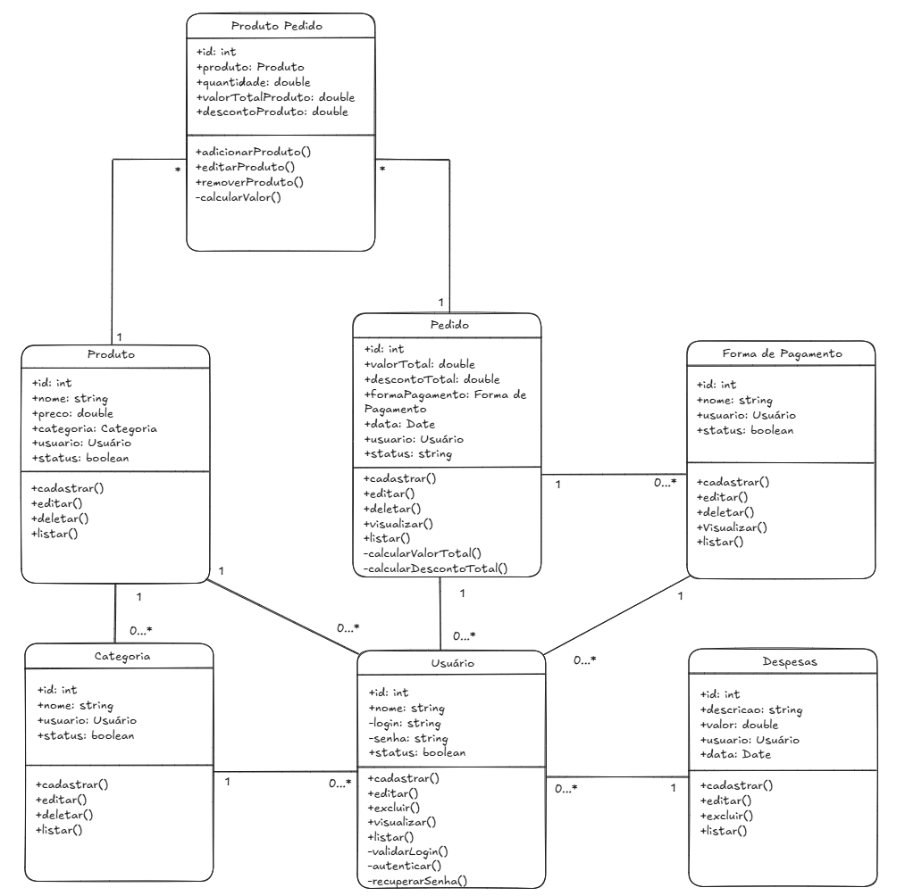

# Diagrama de Classes - Sistema de Cantina Universitária

## 🏗️ Classes Principais e Suas Responsabilidades

### 1. 👤 Usuário

**Atributos:**

- `id`: Identificador único
- `nome`: Nome do usuário
- `login`: Login para acesso
- `senha`: Senha criptografada
- `status`: Status ativo/inativo

**Métodos:**

- `cadastrar()`: Registra novo usuário
- `editar()`: Atualiza dados do usuário
- `excluir()`: Remove usuário do sistema
- `visualizar()`: Exibe dados do usuário
- `listar()`: Lista todos os usuários
- `validarLogin()`: Valida credenciais
- `autenticar()`: Autentica usuário no sistema

**Relacionamentos:**

- Está relacionado com todas as outras entidades como proprietário (1 usuário → vários elementos)

---

### 2. 📦 Produto

**Atributos:**

- `id`: Identificador único
- `nome`: Nome do produto
- `preço`: Valor do produto
- `categoria`: Categoria do produto
- `usuário`: Usuário responsável
- `status`: Status ativo/inativo

**Métodos:**

- `cadastrar()`: Registra novo produto
- `editar()`: Atualiza dados do produto
- `deletar()`: Remove produto
- `listar()`: Lista produtos

**Relacionamentos:**

- 1 produto pertence a 1 categoria
- 1 produto pode estar em muitos pedidos
- 1 produto é criado por 1 usuário

---

### 3. 🏷️ Categoria

**Atributos:**

- `id`: Identificador único
- `nome`: Nome da categoria
- `usuário`: Usuário responsável
- `status`: Status ativo/inativo

**Métodos:**

- `cadastrar()`: Registra nova categoria
- `editar()`: Atualiza dados da categoria
- `deletar()`: Remove categoria
- `listar()`: Lista categorias

**Relacionamentos:**

- 1 categoria pode estar relacionada a 0 ou vários produtos
- Associada a 1 usuário

---

### 4. 🛒 Pedido

**Atributos:**

- `id`: Identificador único
- `valorTotal`: Valor total do pedido
- `descontoTotal`: Desconto aplicado
- `formaPagamento`: Forma de pagamento utilizada
- `data`: Data do pedido
- `usuário`: Usuário responsável
- `status`: Status do pedido

**Métodos:**

- `cadastrar()`: Registra novo pedido
- `editar()`: Atualiza dados do pedido
- `deletar()`: Remove pedido
- `visualizar()`: Exibe detalhes do pedido
- `listar()`: Lista pedidos
- `calcularValorTotal()`: Calcula valor total
- `calcularDescontoTotal()`: Calcula desconto total

**Relacionamentos:**

- 1 pedido tem muitos produtos
- 1 pedido tem 1 forma de pagamento
- Pertence a 1 usuário

---

### 5. 🔗 ProdutoPedido

**Atributos:**

- `id`: Identificador único
- `produto`: Produto relacionado
- `quantidade`: Quantidade do produto
- `valorTotalProduto`: Valor total do produto
- `descontoProduto`: Desconto aplicado ao produto

**Métodos:**

- `adicionarProduto()`: Adiciona produto ao pedido
- `editarProduto()`: Edita produto no pedido
- `removerProduto()`: Remove produto do pedido
- `calcularValor()`: Calcula valor do produto

**Relacionamentos:**

- Relaciona Produto com Pedido (Tabela de associação)

---

### 6. 💳 Forma de Pagamento

**Atributos:**

- `id`: Identificador único
- `nome`: Nome da forma de pagamento
- `usuário`: Usuário responsável
- `status`: Status ativo/inativo

**Métodos:**

- `cadastrar()`: Registra nova forma de pagamento
- `editar()`: Atualiza forma de pagamento
- `deletar()`: Remove forma de pagamento
- `visualizar()`: Exibe detalhes
- `listar()`: Lista formas de pagamento

**Relacionamentos:**

- 1 forma de pagamento pode ser usada em vários pedidos
- Associada a 1 usuário

---

### 7. 💰 Despesas

**Atributos:**

- `id`: Identificador único
- `descrição`: Descrição da despesa
- `valor`: Valor da despesa
- `data`: Data da despesa
- `usuário`: Usuário responsável

**Métodos:**

- `cadastrar()`: Registra nova despesa
- `editar()`: Atualiza despesa
- `excluir()`: Remove despesa
- `listar()`: Lista despesas

**Relacionamentos:**

- Associada a 1 usuário

---

## 🔗 Diagrama Visual

**Link para visualização do diagrama:**
[Diagrama no Excalidraw](https://excalidraw.com/#room=31cc694807f2d12c353d,NzMt6FP0MgH8HrOI82OQu)

---

## 📋 Resumo dos Relacionamentos

| Entidade                 | Relacionamento | Cardinalidade                              |
| ------------------------ | -------------- | ------------------------------------------ |
| Usuário → Produto        | 1:N            | Um usuário pode criar vários produtos      |
| Usuário → Categoria      | 1:N            | Um usuário pode criar várias categorias    |
| Usuário → Pedido         | 1:N            | Um usuário pode fazer vários pedidos       |
| Usuário → FormaPagamento | 1:N            | Um usuário pode criar várias formas        |
| Usuário → Despesa        | 1:N            | Um usuário pode registrar várias despesas  |
| Categoria → Produto      | 1:N            | Uma categoria pode ter vários produtos     |
| Pedido → ProdutoPedido   | 1:N            | Um pedido pode ter vários produtos         |
| Produto → ProdutoPedido  | 1:N            | Um produto pode estar em vários pedidos    |
| FormaPagamento → Pedido  | 1:N            | Uma forma pode ser usada em vários pedidos |
